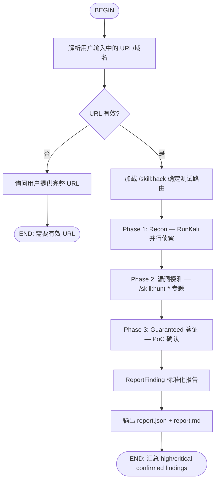

---
name: auto-vuln-hunt
description: >-
  Full-auto vulnerability hunting from natural language (e.g. "帮我挖 example.com 的漏洞").
  Runs Wildcard recon + Guaranteed confirm with visible Wire/scan progress and ReportFinding.
  Use when user asks to find bugs, dig vulns, bounty hunt, or test a website URL.
type: flow
---

# Auto Vuln Hunt — 口语化全自动挖洞

用户用自然语言描述目标时（如「帮我挖 xxx 的漏洞」「找一下这个站的高危洞」），按本流程执行。

## Prerequisites

- LLM API 已配置（`kxns api` 或 Web 设置）
- Kali 工具可用（`kxns doctor`）
- 工作模式：**全自动**（`--yolo`），进度必须对用户可见

## Flow



## RunKali 必备工具使用表

所有 Recon 和漏洞探测 **必须** 使用 `RunKali(tool_name)` 而非 `Shell: tool_name ...`。
RunKali 会自动构建命令、解析输出、产生结构化 Finding。

| 阶段 | 场景 | 必须使用 |
|------|------|----------|
| 子域名枚举 | 发现目标关联资产 | `RunKali(subfinder, target="domain")` |
| DNS 全面侦察 | 深度 DNS 信息收集 | `RunKali(dnsenum, target="domain")` |
| 端口扫描 | 全端口 / 服务版本 | `RunKali(nmap, target="IP", ...)` |
| 大规模端口 | 快速全端口 | `RunKali(masscan, target="IP", ...)` |
| HTTP 探测 | Web 服务存活 + 响应头 | `RunKali(httpx, target="url")` |
| Web 指纹 | 技术栈识别 | `RunKali(whatweb, target="url")` |
| WAF 检测 | 识别 WAF/CDN | `RunKali(wafw00f, target="url")` |
| 目录爆破 | 路径/文件枚举 | `RunKali(ffuf) / RunKali(gobuster) / RunKali(feroxbuster) / RunKali(dirb)` |
| 参数 Fuzz | API 参数发现 | `RunKali(wfuzz, ...)` |
| 漏洞扫描 | 自动化漏洞检测 | `RunKali(nuclei, target="url")` |
| Web 漏洞 | Nikto 综合扫描 | `RunKali(nikto, target="url")` |
| SQL 注入 | 自动检测+利用 | `RunKali(sqlmap, target="url")` |
| 命令注入 | 自动检测 | `RunKali(commix, target="url")` |
| CMS 漏洞 | WordPress 专项 | `RunKali(wpscan, target="url")` |
| SMB 枚举 | 内网 Windows | `RunKali(enum4linux, target="IP")` |
| 漏洞搜索 | CVE/Exploit 查找 | `RunKali(searchsploit, query="...")` |

> 说明：`RunKali(hydra)` 和 `RunKali(responder)` 是风控工具，非自动模式下需用户确认。

## Execution Steps

1. **Extract target** — URL from user message; default `https://` if scheme missing.
2. **Announce plan** — Tell user scan phases and that progress will stream live.
3. **Phase 1: Recon（并行）** — 同时启动以下 RunKali 调用：
   - `RunKali(subfinder, target="domain")` — 子域名
   - `RunKali(nmap, target="hostname", ports="top-1000", fast=True)` — 快速端口
   - `RunKali(whatweb, target="url")` — 技术栈指纹
   - `RunKali(wafw00f, target="url")` — WAF 检测
   - `RunKali(httpx, target="url", flags=["-tech-detect"])` — HTTP 探测
4. **Phase 2: 漏洞探测** — 根据 Phase 1 结果路由到专题 skill：
   - SQL 参数 → `/skill:hunt-sqli` + `RunKali(sqlmap)`
   - 反射点 → `/skill:hunt-xss`
   - 文件操作 → `/skill:hunt-lfi` / `/skill:hunt-file-upload`
   - API 端点 → `/skill:hunt-idor` / `/skill:hunt-api-misconfig`
   - 登录页 → `/skill:hunt-auth-bypass` + `/skill:jwt-attack`
   - CMS → `RunKali(wpscan)` + `/skill:hunt-wordpress`
   - 全面扫描 → `RunKali(nuclei, target="url")` + `RunKali(nikto, target="url")`
5. **Phase 3: Guaranteed 验证** — 对每个疑似漏洞：
   - 构造 PoC 请求（curl / python requests）
   - 必须获取真实响应确认漏洞存在
   - **禁止未获得工具输出就声称漏洞存在**
6. **Report** — 每个 confirmed finding 立即 ReportFinding：
   ```
   ReportFinding(
     title="...",
     severity="high/critical/medium/low",
     description="...",
     poc="真实 curl 命令 + 完整响应",
     remediation="...",
   )
   ```
7. **Summary** — 输出 findings 表 + `report.json` / `report.md` 路径

## 反编造红线（必须遵守）

以下行为**严格禁止**，违者等同于编造漏洞：

1. **禁止无 PoC 的漏洞声明**：任何 claimed vulnerability 必须附带工具真实输出（原始文本、HTTP 响应、时间戳）
2. **禁止猜测工具结果**：如果 `RunKali` 或 `Shell` 命令失败/超时/返回空，必须如实报告失败，不得推测"可能存在问题"
3. **禁止描述无法复现的攻击链**：组合漏洞必须每一步都可独立验证
4. **禁止夸大漏洞等级**：严格按 CVSS 标准评级，不因是非法站点而升级描述
5. **禁止跳过验证步骤**：Phase 3 Guaranteed 验证不可省略，不可从 Phase 2 直接跳到报告
6. **每个 finding 必须包含**：
   - 发现时间（ISO 8601）
   - 使用的工具及完整命令
   - 工具原始输出（至少前 500 字符）
   - 可独立复现的 PoC

## Oral Language Triggers

Examples that should invoke this skill:

- 帮我挖 https://target.com 的漏洞
- 找一下 example.com 有没有高危洞
- 对这个站做赏金测试
- bounty hunt on target.com

## Output Contract

- Every real finding → `ReportFinding` with severity, description, poc
- Final user message → table of findings + paths to `report.json` / `report.md`

